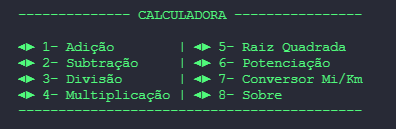
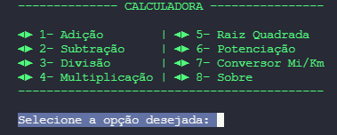
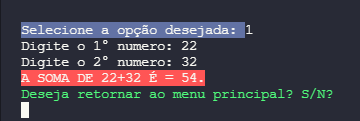
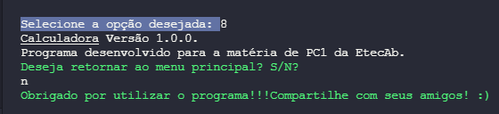

# Calculadora 1.0.

Projeto proposto pela matéria de PC da EtecAB, para a criação de um aplicativo com função interativa com o usuário.

---

## _Screenshot_

Escolha a opção desejada:

Execução do programa:

Final do programa:

---

## _Download_

Baixe o arquivo abaixo.

[📚 Download do arquivo .zip](dist/calculadora.zip)

---
